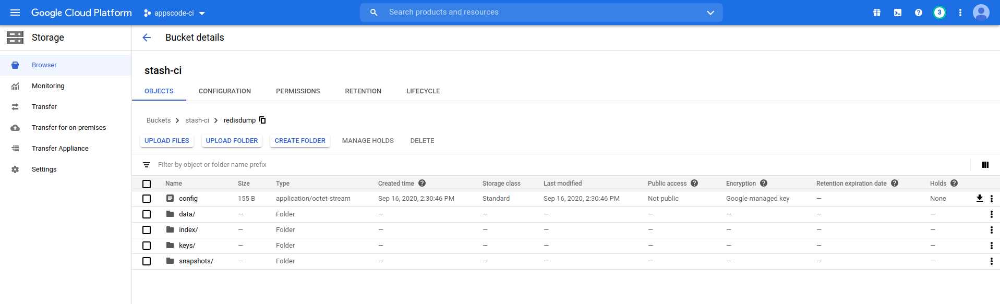

# Backup and Restore Redis database using Stash

Stash 0.9.0+ supports backup and restoration of Redis databases. This guide will show you how you can backup and restore your Redis database with Stash.

## Before You Begin

- At first, you need to have a Kubernetes cluster, and the `kubectl` command-line tool must be configured to communicate with your cluster. If you do not already have a cluster, you can create one by using Minikube.
- Install Stash in your cluster following the steps [here](/docs/setup/README.md).
- Install Redis addon for Stash following the steps [here](/docs/addons/redis/setup/install.md)
- Install [KubeDB](https://kubedb.com) in your cluster following the steps [here](https://kubedb.com/docs/latest/setup/install/). This step is optional. You can deploy your database using any method you want. We are using KubeDB because KubeDB simplifies many of the difficult or tedious management tasks of running a production grade databases on private and public clouds.
- If you are not familiar with how Stash backup and restore Redis databases, please check the following guide [here](/docs/addons/redis/overview.md).

You have to be familiar with following custom resources:

- [AppBinding](/docs/concepts/crds/appbinding.md)
- [Function](/docs/concepts/crds/function.md)
- [Task](/docs/concepts/crds/task.md)
- [BackupConfiguration](/docs/concepts/crds/backupconfiguration.md)
- [RestoreSession](/docs/concepts/crds/restoresession.md)

To keep things isolated, we are going to use a separate namespace called `demo` throughout this tutorial. Create `demo` namespace if you haven't created yet.

```bash
$ kubectl create ns demo
namespace/demo created
```

> Note: YAML files used in this tutorial are stored [here](https://github.com/stashed/redis/tree//docs/examples).

## Backup Redis

This section will demonstrate how to backup Redis database. Here, we are going to deploy a Redis database using KubeDB. Then, we are going to backup this database into a GCS bucket. Finally, we are going to restore the backed up data into another Redis database. For taking backup stash has mainly two models. One is side car model & the other one is job model. Here in this doc, we are going to demonstrate the process that uses the job model.

### Deploy Sample Redis Database

Let's deploy a sample Redis database and insert some data into it.

**Create Redis CRD:**

Below is the YAML of a sample Redis CRD that we are going to create for this tutorial:

```yaml
apiVersion: kubedb.com/v1alpha1
kind: Redis
metadata:
  name: sample-redis
  namespace: demo
spec:
  version: 5.0.3-v1
  storageType: Durable
  storage:
    storageClassName: "standard"
    accessModes:
    - ReadWriteOnce
    resources:
      requests:
        storage: 1Gi
  terminationPolicy: WipeOut
```

Create the above `Redis` CRD,

```bash
$ kubectl apply -f https://github.com/stashed/redis/raw//docs/examples/backup/sample-redis.yaml
redis.kubedb.com/sample-redis created
```

KubeDB will deploy a Redis database according to the above specification. It will also create the necessary Services to access the database.

Let's check if the database is ready to use,

```bash
$ kubectl get redis -n demo sample-redis
NAME           VERSION    STATUS    AGE
sample-redis   5.0.3-v1   Running   70s
```

The database is `Running`. Verify that KubeDB has created a Service for this database using the following commands,

```bash

$ kubectl get service -n demo -l=kubedb.com/name=sample-redis
NAME           TYPE        CLUSTER-IP     EXTERNAL-IP   PORT(S)    AGE
sample-redis   ClusterIP   10.96.74.231   <none>        6379/TCP   2m9s
```

Here, we have to use service `sample-redis` to connect with the database. KubeDB creates an [AppBinding](/docs/concepts/crds/appbinding.md) CRD that holds the necessary information to connect with the database.

**Verify AppBinding:**

Verify that the AppBinding has been created successfully using the following command,

```bash
$ kubectl get appbinding -n demo
NAME           TYPE               VERSION   AGE
sample-redis   kubedb.com/redis   5.0.3     4m2s
```

Let's check the YAML of the above AppBinding,

```bash
$ kubectl get appbindings -n demo sample-redis -o yaml
```

```yaml
apiVersion: appcatalog.appscode.com/v1alpha1
kind: AppBinding
metadata:
  annotations:
    kubectl.kubernetes.io/last-applied-configuration: |
      {"apiVersion":"kubedb.com/v1alpha1","kind":"Redis","metadata":{"annotations":{},"name":"sample-redis","namespace":"demo"},"spec":{"storage":{"accessModes":["ReadWriteOnce"],"resources":{"requests":{"storage":"1Gi"}},"storageClassName":"standard"},"storageType":"Durable","version":"5.0.3-v1"}}
  creationTimestamp: "2020-09-16T06:17:06Z"
  generation: 1
  labels:
    app.kubernetes.io/component: database
    app.kubernetes.io/instance: sample-redis
    app.kubernetes.io/managed-by: kubedb.com
    app.kubernetes.io/name: redis
    app.kubernetes.io/version: 5.0.3-v1
    kubedb.com/kind: Redis
    kubedb.com/name: sample-redis
  name: sample-redis
  namespace: demo
  ownerReferences:
  - apiVersion: kubedb.com/v1alpha1
    blockOwnerDeletion: true
    controller: true
    kind: Redis
    name: sample-redis
    uid: aa1901e5-9695-4548-9a03-a899083bfb1a
  resourceVersion: "2860"
  selfLink: /apis/appcatalog.appscode.com/v1alpha1/namespaces/demo/appbindings/sample-redis
  uid: 8b49f9e2-058c-47f8-9e4f-b386a47f33d9
spec:
  clientConfig:
    service:
      name: sample-redis
      port: 6379
      scheme: redis
  type: kubedb.com/redis
  version: 5.0.3
```

Stash uses the AppBinding CRD to connect with the target database. It requires the following two fields to set in AppBinding's `.spec` section.

- `.spec.clientConfig.service.name` specifies the name of the Service that connects to the database.
- `spec.type` specifies the types of the app that this AppBinding is pointing to. KubeDB generated AppBinding follows the following format: `<app group>/<app resource type>`.

**Creating AppBinding Manually:**

If you deploy Redis database without KubeDB, you have to create the AppBinding CRD manually in the same namespace as the service of the database.

The following YAML shows a minimal AppBinding specification that you have to create if you deploy Redis database without KubeDB.

```yaml
apiVersion: appcatalog.appscode.com/v1alpha1
kind: AppBinding
metadata:
  name: <my_custom_appbinding_name>
  namespace: <my_database_namespace>
spec:
  clientConfig:
    service:
      name: <my_database_service_name>
      port: <my_database_port_number>
      scheme: redis
  # type field is optional. you can keep it empty.
  # if you keep it empty then the value of TARGET_APP_RESOURCE variable
  # will be set to "appbinding" during auto-backup.
  type: redis
```

You have to replace the `<...>` quoted part with proper values in the above YAML.

**Insert Sample Data:**

Now, we are going to exec into the database pod and create some sample data. At first, find out the database Pod using the following command,

```bash
$ kubectl get pods -n demo --selector="kubedb.com/name=sample-redis"
NAME             READY   STATUS    RESTARTS   AGE
sample-redis-0   1/1     Running   0          33m
```


Now, let's exec into the Pod to enter into `redis` shell and store some data to backup and restore later:

```bash
$ kubectl exec -it sample-redis-0 -n demo -- sh
/data # redis-cli
127.0.0.1:6379> set hello world
OK
127.0.0.1:6379> set stash backup
OK
127.0.0.1:6379> set AppsCode KubeDB
OK
127.0.0.1:6379> exit
/data # exit
```

Now, we are ready to backup the database.

### Prepare Backend

We are going to store our backed up data into a GCS bucket. At first, we need to create a secret with GCS credentials then we need to create a `Repository` CRD. If you want to use a different backend, please read the respective backend configuration doc from [here](/docs/guides/latest/backends/overview.md).

**Create Storage Secret:**

Let's create a secret called `gcs-secret` with access credentials to our desired GCS bucket,

```bash
$ echo -n 'changeit' > RESTIC_PASSWORD
$ echo -n '<your-project-id>' > GOOGLE_PROJECT_ID
$ cat downloaded-sa-json.key > GOOGLE_SERVICE_ACCOUNT_JSON_KEY
$ kubectl create secret generic -n demo gcs-secret \
    --from-file=./RESTIC_PASSWORD \
    --from-file=./GOOGLE_PROJECT_ID \
    --from-file=./GOOGLE_SERVICE_ACCOUNT_JSON_KEY
secret/gcs-secret created
```

**Create Repository:**

Now, crete a `Repository` using this secret. Below is the YAML of Repository CRD we are going to create,

```yaml
apiVersion: stash.appscode.com/v1alpha1
kind: Repository
metadata:
  name: redis-standalone-repo
  namespace: demo
spec:
  backend:
    gcs:
      bucket: stash-ci
      prefix: /redisdump
    storageSecretName: gcs-secret
```

Let's create the `Repository` we have shown above,

```bash
$ kubectl create -f https://github.com/stashed/redis/raw//docs/examples/backup/repository.yaml
repository.stash.appscode.com/gcs-repo created
```

Now, we are ready to backup our database to our desired backend.

### Backup

We have to create a `BackupConfiguration` targeting respective AppBinding CRD of our desired database. Then Stash will create a CronJob to periodically backup the database.

**Create BackupConfiguration:**

Below is the YAML for `BackupConfiguration` CRD to backup the `sample-redis` database we have deployed earlier,

```yaml
apiVersion: stash.appscode.com/v1beta1
kind: BackupConfiguration
metadata:
  name: sample-redis-backup
  namespace: demo
spec:
  schedule: "*/5 * * * *"
  task:
    name: redis-backup-5.0.3
  repository:
    name: redis-standalone-repo
  target:
    ref:
      apiVersion: appcatalog.appscode.com/v1alpha1
      kind: AppBinding
      name: sample-redis
  retentionPolicy:
    name: keep-last-5
    keepLast: 5
    prune: true
```

Here,

- `.spec.schedule` specifies that we want to backup the database at 5 minutes interval.
- `.spec.task.name` specifies the name of the Task CRD that specifies the necessary Functions and their execution order to backup a Redis database.
- `.spec.target.ref` refers to the AppBinding CRD that was created for `sample-redis` database.

Let's create the `BackupConfiguration` CRD we have shown above,

```bash
$ kubectl create -f https://github.com/stashed/redis/raw//docs/examples/backup/backupconfiguration.yaml
backupconfiguration.stash.appscode.com/sample-redis-backup created
```

**Verify CronJob:**

If everything goes well, Stash will create a CronJob with the schedule specified in `spec.schedule` field of `BackupConfiguration` CRD.

Verify that the CronJob has been created using the following command,

```bash
$ kubectl get cronjob -n demo
NAME                               SCHEDULE      SUSPEND   ACTIVE   LAST SCHEDULE   AGE
stash-backup-sample-redis-backup   */5 * * * *   False     0        <none>          43s
```

**Wait for BackupSession:**

The `sample-redis-backup` CronJob will trigger a backup on each scheduled slot by creating a `BackupSession` CRD.

Wait for a schedule to appear. Run the following command to watch `BackupSession` CRD,

```bash
$ watch -n 1 kubectl get backupsession -n demo -l=stash.appscode.com/invoker-name=sample-redis-backup

Every 1.0s: kubectl get backupsession -n demo -l=stash.appscode.com/invoker-name=sample-redis-backup   workstation: Fri Sep 27 11:14:43 2019

NAME                             INVOKER-TYPE          INVOKER-NAME          PHASE       AGE
sample-redis-backup-1569561245   BackupConfiguration   sample-redis-backup   Succeeded   38s
```

Here, the phase **`Succeeded`** means that the backupsession has been succeeded.

>Note: Backup CronJob creates `BackupSession` crds with the following label `stash.appscode.com/invoker-name=<BackupConfiguration crd name>`. We can use this label to watch only the `BackupSession` of our desired `BackupConfiguration`.

**Verify Backup:**

Now, we are going to verify whether the backed up data is in the backend. Once a backup is completed, Stash will update the respective `Repository` CRD to reflect the backup completion. Check that the repository `redis-standalone-repo` has been updated by the following command,

```bash
$ kubectl get repository -n demo redis-standalone-repo
NAME                    INTEGRITY   SIZE    SNAPSHOT-COUNT   LAST-SUCCESSFUL-BACKUP   AGE
redis-standalone-repo   true        133 B   1                                         115m
```

Now, if we navigate to the GCS bucket, we will see the backed up data has been stored in `redisdump` directory as specified by `.spec.backend.gcs.prefix` field of Repository CRD.

<figure align="center">
  
  <figcaption align="center">Fig: Backup data in GCS Bucket</figcaption>
</figure>

> Note: Stash keeps all the backed up data encrypted. So, data in the backend will not make any sense until they are decrypted.

## Restore Redis

In this section, we are going to restore the database from the backup we have taken in the previous section. We are going to deploy a new database and initialize it from the backup.

**Stop Taking Backup of the Old Database:**

At first, let's stop taking any further backup of the old database so that no backup is taken during restore process. We are going to pause the `BackupConfiguration` crd that we had created to backup the `sample-redis` database. Then, Stash will stop taking any further backup for this database.

Let's pause the `sample-redis-backup` BackupConfiguration,

```console
$ kubectl patch backupconfiguration -n demo sample-redis-backup --type="merge" --patch='{"spec": {"paused": true}}'
backupconfiguration.stash.appscode.com/sample-redis-backup patched
```

Now, wait for a moment. Stash will pause the BackupConfiguration. Verify that the BackupConfiguration  has been paused,

```console
$ kubectl get backupconfiguration -n demo sample-redis-backup
NAMESPACE   NAME                  TASK                       SCHEDULE      PAUSED   AGE
demo        sample-redis-backup   redis-backup-5.0.3   */5 * * * *   true     25m
```

Notice the `PAUSED` column. Value `true` for this field means that the BackupConfiguration has been paused.

**Deploy Restored Database:**

Now, we have to deploy the restored database similarly as we have deployed the original `sample-redis` database. However, this time there will be the following differences:

- We have to specify `.spec.init` section to tell KubeDB that we are going to use Stash to initialize this database from backup. KubeDB will keep the database phase to **`Initializing`** until Stash finishes its initialization.

Below is the YAML for `Redis` CRD we are going deploy to initialize from backup,

```yaml
apiVersion: kubedb.com/v1alpha1
kind: Redis
metadata:
  name: redis-recovery-test
  namespace: demo
spec:
  version: 5.0.3-v1
  storageType: Durable
  storage:
    storageClassName: "standard"
    accessModes:
    - ReadWriteOnce
    resources:
      requests:
        storage: 1Gi
  init:
    stash:
      kind: RestoreSession
      name: sample-redis-restore
```

Here,

- `spec.init.stash.name` specifies the `RestoreSession` CRD name that we will use later to restore the database.

Let's create the above database,

```bash
$ kubectl apply -f https://github.com/stashed/redis/raw//docs/examples/restore/restored-redis.yaml
redis.kubedb.com/restored-redis created
```

If you check the database status, you will see it is stuck in **`Initializing`** state.

```bash
$ kubectl get my -n demo redis-recovery-test
NAMESPACE   NAME                  VERSION    STATUS         AGE
demo        redis-recovery-test   5.0.3-v1   Initializing   78s
```

**Create RestoreSession:**

Now, we need to create a RestoreSession CRD pointing to the AppBinding for this restored database.

Using the following command, check that another AppBinding object has been created for the `redis-recovery-test` object,

```bash
$ kubectl get appbindings -n demo redis-recovery-test
NAME                  TYPE               VERSION   AGE
redis-recovery-test   kubedb.com/redis   5.0.3     3m34s
```

> If you are not using KubeDB to deploy database, create the AppBinding manually.

Below is the contents of YAML file of the RestoreSession CRD that we are going to create to restore backed up data into the newly created database provisioned by Redis CRD named `redis-recovery-test`.

```yaml
apiVersion: stash.appscode.com/v1beta1
kind: RestoreSession
metadata:
  name: sample-redis-restore
  namespace: demo
  labels:
    kubedb.com/kind: Redis # this label is mandatory if you are using KubeDB to deploy the database.
spec:
  task:
    name: redis-restore-5.0.3
  repository:
    name: redis-standalone-repo
  target:
    ref:
      apiVersion: appcatalog.appscode.com/v1alpha1
      kind: AppBinding
      name: redis-recovery-test
  rules:
    - snapshots: [latest]
```

Here,

- `.metadata.labels` specifies a `kubedb.com/kind: Redis` label that is used by KubeDB to watch this RestoreSession object.
- `.spec.task.name` specifies the name of the Task CRD that specifies the necessary Functions and their execution order to restore a Redis database.
- `.spec.repository.name` specifies the Repository CRD that holds the backend information where our backed up data has been stored.
- `.spec.target.ref` refers to the newly created AppBinding object for the `restored-redis` Redis object.
- `.spec.rules` specifies that we are restoring data from the latest backup snapshot of the database.

> **Warning:** Label `kubedb.com/kind: Redis` is mandatory if you are using KubeDB to deploy the database. Otherwise, the database will be stuck in **`Initializing`** state.

Let's create the RestoreSession CRD object we have shown above,

```bash
$ kubectl apply -f https://github.com/stashed/redis/raw//docs/examples/restore/restoresession.yaml
restoresession.stash.appscode.com/sample-redis-restore created
```

Once, you have created the RestoreSession object, Stash will create a restore Job. We can watch the phase of the RestoreSession object to check whether the restore process has succeeded or not.

Run the following command to watch the phase of the RestoreSession object,

```bash
$ watch -n 1 kubectl get restoresession -n demo sample-redis-restore

Every 1.0s: kubectl get restoresession -n demo  sample-redis-restore    workstation: Fri Sep 27 11:18:51 2019
NAMESPACE   NAME                   REPOSITORY              PHASE       AGE
demo        sample-redis-restore   redis-standalone-repo   Succeeded   3m2s
```

Here, we can see from the output of the above command that the restore process succeeded.

**Verify Restored Data:**

In this section, we are going to verify whether the desired data has been restored successfully. We are going to connect to the database server and check whether the database and the table we created earlier in the original database are restored.

At first, check if the database has gone into **`Running`** state by the following command,

```bash
$ kubectl get redis -n demo redis-recovery-test
NAME                  VERSION    STATUS    AGE
redis-recovery-test   5.0.3-v1   Running   6m50s
```

Now, find out the database Pod by the following command,

```bash
$ kubectl get pods -n demo --selector="kubedb.com/name=redis-recovery-test"
NAME                    READY   STATUS    RESTARTS   AGE
redis-recovery-test-0   1/1     Running   0          7m46s
```


Now, let's exec into the Pod to enter into `redis` shell and verify that the previous data that we just restored are found in the `redis` instance:
```bash
$ kubectl exec -it redis-recovery-test-0 -n demo -- sh
/data # redis-cli
127.0.0.1:6379> get hello
"world"
127.0.0.1:6379> get stash
"backup"
127.0.0.1:6379> get AppsCode
"KubeDB"
127.0.0.1:6379> get random
(nil)
127.0.0.1:6379> exit
/data # exit
```
So, from the above output, we can see that the data we stored in the previous `sample-redis` database before taking backup is restored into the new `redis-recovery-test` instance, they are restored successfully.

## Cleanup

To cleanup the Kubernetes resources created by this tutorial, run:

```bash
kubectl delete backupconfiguration -n demo sample-redis-backup
kubectl delete restoresession -n demo restore-sample-redis
kubectl delete repository -n demo gcs-repo
kubectl delete my -n demo restored-redis
kubectl delete my -n demo sample-redis
```
